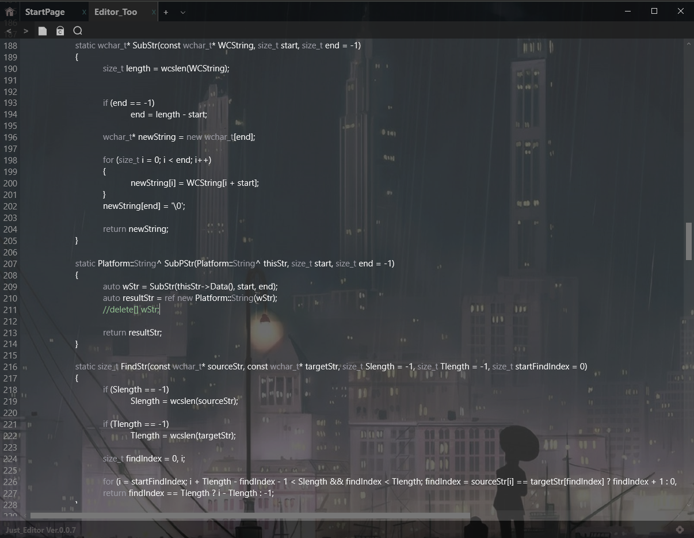

<h1>JustEditor</h1> 
Just_Editor is a UWP code editor, it supports Http/Https Post/Get request, Caesar decode, code highlight and smart detect. 
<h3>Privacy</h3>
This app may require file operation, http request. I'm not going to collect your information.
 
<h3>Screenshot</h3>

 
<h3>Copyright</h3>
You can modify, copy or reproduced my code, and you can put "Duronsoft" in somewhere properly or not.
 